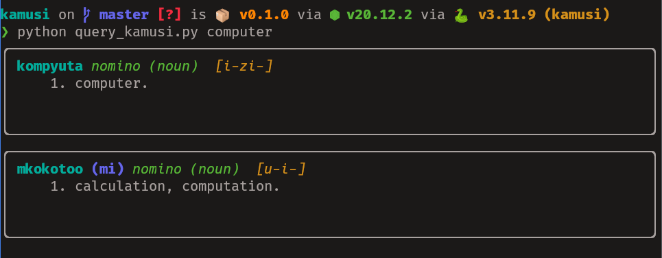

# Swahili-English Dictionary Data and Interface

This repository contains code that extracts data from a Swahili-English
dictionary in PDF form into a JSON dataset. Additionally it contains a simple
CLI for searching through the data as well as a PWA serving the same purpose.

An article explaining the code in this repo is can be read online [here][3] 
or from [docs/kamusi.qmd](docs/kamusi.md)


## Usage

The finished results are already part of the repo and can be used in two ways. 
The CLI interface requires the availability of [`duckdb`][1] and a Python 
environment with [`rich`][2] installed. First load the database into DuckDB 
and create a FTS index with: 

```sh
duckdb data/kamusi.db < create_kamusi.sql
```

Then query for a term by passing it as an argument to `query_kamusi.py`




Using the PWA can be done by visiting the online version [here][3] or
alternatively starting a server in the `website` directory of this repo:

```sh
cd website && python -m http.server
```

Alternatively if you want to run the extraction code then install the project's
Python requirements:

```sh
pip install --requirement requirements.txt
```

Then run `python kamusi.py`


- [ ] TODO: add link to GitHub repo to PWA 
- [ ] TODO: update requirements.txt

[1]: https://duckdb.org
[2]: https://rich.readthedocs.io/en/stable/
[3]: https://julius383.github.io/kamusi
